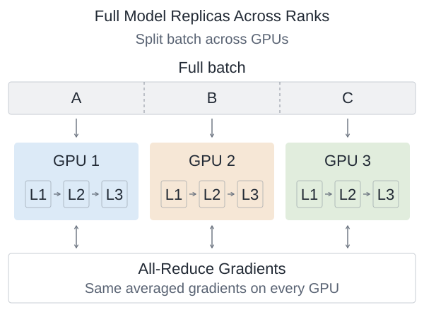
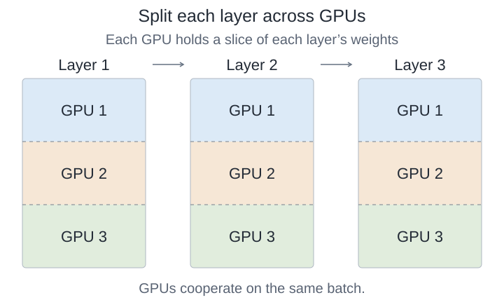
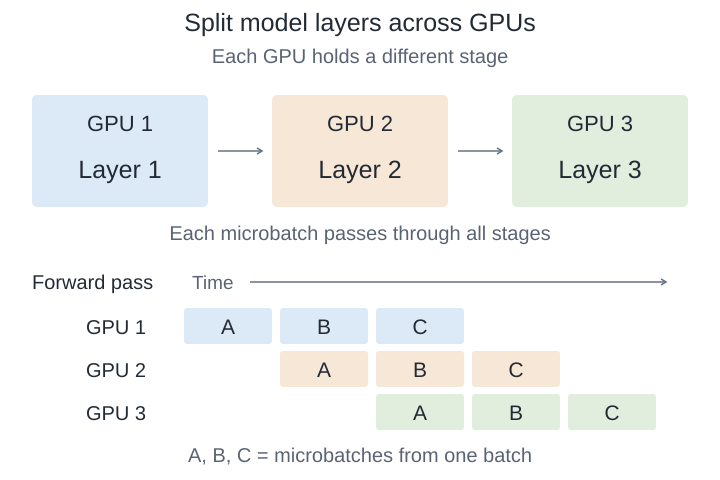

# Distributed Training

## Primitives

A *rank* identifies a participating process, typically managing one GPU; the *root* is the designated source or destination. All ranks below belong to the participating group.

| Primitive | Communication pattern | Description | Operation type |
| --- | --- | --- | --- |
| **Broadcast** | One-to-many | Copies the **same tensor** from the root to every rank. | `Data Transfer` |
| **Scatter** | One-to-many | Distributes **different chunks** of the root's data to different ranks. | `Data Transfer` |
| **Gather** | Many-to-one | Collects every rank's data at the root, keeping contributions separate. | `Data Transfer` |
| **Reduce** | Many-to-one | Combines tensors element-wise using an operation such as sum or max; only the root receives the result. | `Data Transfer`, `Arithmetic` |
| **All-Reduce** | Many-to-many | Combines tensors element-wise and gives every rank the **same complete result**. | `Data Transfer`, `Arithmetic` |
| **All-Gather** | Many-to-many | Collects every rank's data and gives every rank the **full collection**. | `Data Transfer` |
| **Reduce-Scatter** | Many-to-many | Combines tensors element-wise and gives each rank a **different chunk of the result**. | `Data Transfer`, `Arithmetic` |
| **All-to-All** | Many-to-many | Each rank sends a distinct chunk to every other rank and receives one from each. | `Data Transfer` |
| **Barrier** | All ranks synchronize | Makes each rank wait until every rank in the group reaches the barrier. | — |

*Operation type can have multiple tags. Tags describe the operation on application data; Barrier only synchronizes ranks, so neither applies.*

References: [NCCL collective operations](https://docs.nvidia.com/deeplearning/nccl/user-guide/docs/usage/collectives.html), [PyTorch distributed communication](https://docs.pytorch.org/docs/stable/distributed.html).

## Parallelism Techniques

### Data Parallelism

**Data parallelism (DP)** replicates the model across GPUs. Each replica processes different examples and synchronizes gradients.

**Training step — four GPUs, 32 examples:**

1. **Initialize:** every GPU starts with identical parameters and optimizer state.
2. **Forward:** each GPU processes eight different examples and computes its local mean loss.
3. **Backward:** each computes gradients for the full model. All-Reduce combines them so every GPU receives the same average:

    $$
    g=\frac{g_0+g_1+g_2+g_3}{4}
    $$

    Here $g_i$ is GPU $i$'s local gradient; equal local batch sizes make their average the global mean gradient.

4. **Update:** identical optimizer updates keep the replicas synchronized.

Gradient synchronization can overlap backward computation: ready gradient buckets communicate while other gradients are still being computed.

| Component | Behavior and consequence |
| --- | --- |
| **Parameters, gradients, optimizer state** | Fully replicated. DP does not reduce model-state memory per GPU. |
| **Activations** | Stored for local examples. Splitting a fixed batch reduces each GPU's activation workload. |
| **Communication** | Parameter-gradient All-Reduce; payload depends on parameter count and gradient precision. |
| **Scaling limits** | Small local batches underutilize GPUs; communication and slow replicas can limit progress. |

**Batch accounting:**

$$
B_{\text{global}}=D\times b\times K
$$

$D$: replicas; $b$: examples per GPU per microbatch; $K$: accumulated microbatches per update.

Example: $4\times8\times2=64$ examples per optimizer step. Accumulation retains gradients across microbatches; synchronization can be deferred to the final microbatch when configured appropriately. Normalize accumulated gradients consistently with the intended mean loss.

References: [PyTorch DDP design](https://docs.pytorch.org/docs/2.14/notes/ddp.html), [PyTorch DDP tutorial](https://docs.pytorch.org/tutorials/intermediate/ddp_tutorial.html).

### Tensor Parallelism

**Tensor parallelism (TP)** partitions individual layers across GPUs. GPUs process the same examples and compute different parts of each layer.

**Training step — a two-layer MLP on two GPUs:**

$$
H=\operatorname{GELU}(W_1^\top X),\qquad Y=W_2^\top H
$$

Let $X:[4,N]$, $W_1:[4,12]$, and $W_2:[12,4]$, where $N$ is the number of token positions. Biases are omitted. **Tokens are columns**; weights are written as input features by output features, so each projection uses $W^\top X$.

Both GPUs receive the same $X$.

| Tensor | Partition | Each GPU holds |
| --- | --- | --- |
| $W_1:[4,12]$ | Columns: different output features | $[4,6]$ |
| $H:[12,N]$ | Hidden features | $[6,N]$ |
| $W_2:[12,4]$ | Rows: matching input features | $[6,4]$ |

**Forward:**

1. **Column-parallel projection:** GPU $i$ computes $H_i=\operatorname{GELU}(W_{1,i}^\top X)$. Each GPU produces different hidden features; GELU runs locally.
2. **Row-parallel projection:** each computes $Z_i=W_{2,i}^\top H_i$. Each $Z_i:[4,N]$ is a partial contribution to the output.
3. **All-Reduce sum:** $Y=Z_0+Z_1$, giving both GPUs the complete output.

The matching partitions let the hidden activation stay sharded between projections—no intermediate gather is required.

**Backward and update:**

Each GPU receives the same output gradient $dY$, computes gradients for its own weight shards, and produces a partial input gradient. An All-Reduce sums these contributions:

$$
dX=dX_0+dX_1
$$

Here $dY$ and $dX$ denote gradients of the loss with respect to $Y$ and $X$. Each GPU then updates its own weight shards using the corresponding optimizer state. **This paired MLP layout uses one All-Reduce in forward and one in backward.** The reductions sum complementary contributions to one computation.

| Component | Behavior and consequence |
| --- | --- |
| **Parameters, gradients, optimizer state** | Sharded for partitioned weights; approximately $1/T$ of their original memory with $T$ equal partitions. |
| **Activations** | Mixed: $H$ is sharded, while $X$ and $Y$ are replicated here. Total memory does not simply divide by $T$. |
| **Communication** | Activations and activation gradients; payload depends on tensor shapes, precision, and partitioning layout. |
| **Interconnect** | Frequent communication creates dependencies within the model; fast, low-latency links help. |
| **Scaling limits** | Smaller matrix multiplications can reduce GPU efficiency. Dimensions—and attention heads when partitioned by head—must support the chosen split. |

References: [PyTorch TP tutorial](https://docs.pytorch.org/tutorials/intermediate/TP_tutorial.html), [Megatron-LM paper](https://arxiv.org/abs/1909.08053).

### Pipeline Parallelism

